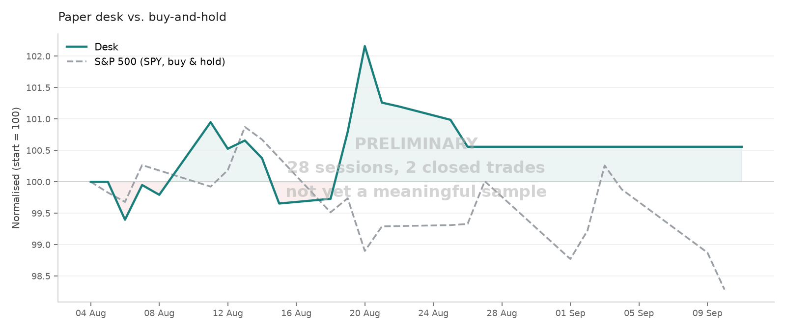

# Paper Trading Desk — Alpaca Harness

<!-- PERFORMANCE:START -->



| | Desk | SPY buy & hold |
|---|---|---|
| Return | +2.16% | -0.26% |
| Max drawdown | -1.28% | -1.35% |
| Avg. gross exposure | 30% | 100% |

*13 sessions, 1 closed trade, updated 2026-08-20.*

The desk holds cash most of the time and SPY does not, so this is not a like-for-like comparison — read it alongside the exposure row rather than as a scoreboard. SPY is dividend- and split-adjusted.

**Sample is far too small to mean anything.** At this length the curve is dominated by noise; a rising line is not evidence of edge. See the calibration table for a measure that becomes informative sooner.

<!-- PERFORMANCE:END -->


Takes the JSON block from Claude's morning brief, enforces the risk rules, sizes
positions from the stop, submits bracket orders to an Alpaca **paper** account,
and logs everything so you can score both P&L and calibration afterwards.

Nothing in here can touch real money: it only ever talks to
`paper-api.alpaca.markets`, and every command is read-only unless you pass
`--confirm`.

---

## 1. Setup

**Account.** Sign up at [alpaca.markets](https://alpaca.markets) — a paper-only
account needs just an email address. Once in, switch the dashboard to **Paper
Trading** (top-left toggle), then generate an API key pair. The secret is shown
exactly once.

While you're there, open the paper account settings and set the starting balance
to **$100,000** to match the system prompt. Leave the account type as margin even
though the prompt specifies no leverage — shorting requires it, and the harness
enforces the cash-like constraints itself.

**Install.**

```bash
pip install -r requirements.txt

export ALPACA_API_KEY_ID='PK...'
export ALPACA_API_SECRET_KEY='...'
```

Put those two exports in your `~/.zshrc` or `~/.bashrc` so they persist. Keys
beginning `PK` are paper keys; live keys begin `AK`. If you ever see an `AK` key
here, stop and regenerate.

**Verify.**

```bash
python3 desk.py status
python3 desk.py check example-plays.json
```

The second command should reject the example's stale AAPL level with a warning
about distance from the last price — that's the sanity check working.

---

## 2. Daily workflow

**Morning (Stockholm time, before 15:30).** Ask Claude for the brief. It returns
prose plus a fenced `json` block. Save the whole reply — the parser finds the JSON
inside markdown fences, so you can paste the entire response verbatim:

```bash
pbpaste > briefs/2026-08-05.md          # macOS
# or just save the reply from the Claude app
python3 desk.py check briefs/2026-08-05.md
```

`check` sends nothing. It prints each play with the derived share count, the
dollar risk, the reward:risk ratio, and any rule violations. Read this before
submitting — it's where hallucinated price levels get caught.

**Submit.**

```bash
python3 desk.py submit briefs/2026-08-05.md --confirm
```

Each play goes in as a bracket order: entry, plus an attached take-profit and
stop-loss that execute unattended. This is the point of the Alpaca route — you're
asleep or at work for most of the US session and the exits still happen.

**Managing positions already open.** `plays` only opens new positions. To move a
stop, lift a target, or exit early, the brief's JSON block carries a `manage`
array alongside `plays`:

```json
"manage": [
  {"ticker": "LLY", "action": "update", "stop": 1242.00, "target": 1293.00,
   "reason": "Thesis matured; trailing the stop above entry to lock the gain."}
]
```

`check` prints the old level next to the new one; `submit --confirm` replaces the
live exit orders on Alpaca (creating them if the position has none) and writes the
new levels back to `journal.csv`. `"action": "close"` cancels the resting orders
and exits at market instead.

Two things this deliberately does *not* do. It does not act on the prose brief —
section 3 saying "raise the stop to 1242" moves nothing on its own, so the model
is instructed to write both. And `no_trade: true` does not suppress it: standing
down means opening nothing new, not leaving open risk unmanaged. Rule 1 still
applies, so widening a stop past 1% entry-to-stop risk is rejected; tightening
one always passes.

**Evening or next morning.**

```bash
python3 desk.py reconcile     # pulls fills, computes R multiples
python3 desk.py score         # performance + calibration report
python3 desk.py status        # current book
```

**Weekly.** Handled automatically once CI is running — the daily session cancels
entries older than 5 days, and the Friday job clears the rest before the weekend
(see section 10). To do it by hand:

```bash
python3 desk.py stale --older-than 5           # list
python3 desk.py stale --older-than 5 --confirm # cancel
```

Unfilled GTC limit orders otherwise accumulate and fill weeks later on an
unrelated move, wrecking your attribution.

**Kill switch.** If `status` reports the daily loss limit breached:

```bash
python3 desk.py flatten --confirm
```

---

## 3. How sizing works

You never specify position size; Claude never specifies position size. The
harness derives it:

```
shares = floor( (equity × risk_per_trade_pct) / |entry − stop| )
```

At $100k equity and 1% risk, a $5-wide stop gives 200 shares — $1,000 at risk
regardless of the share price. This removes an entire class of arithmetic error
from the model and makes rule 1 structural rather than advisory.

The consequence worth understanding: **tight stops produce large notionals.** A
2% stop at 1% risk is a 50% position. That's correct stop-based sizing, not a
bug, but it's why `max_position_pct` and `max_gross_exposure_pct` exist as
backstops. If a play needs more than half the account's notional to express 1% of
risk, the stop is too tight for the timeframe and the harness rejects it.

---

## 4. Rules enforced

Per play — bad geometry (stop on the wrong side of entry, target inside the
stop), untradable or unshortable symbols, entry levels more than 10% from the
last traded price, sizing below one share, single-name notional over 50% of
equity, and malformed or missing probabilities.

Across the book — max 5 concurrent positions, gross exposure ≤ 100% of equity,
no duplicate symbols in one brief, no adding to a name already held, and the 3%
daily loss limit, which blocks all new submissions once breached.

Edit `config.json` to change any of these. Change them between runs, not
mid-experiment.

---

## 5. Reading the score report

`score` gives the usual performance stats, then the part that matters:

```
CALIBRATION   5 trades with a stated probability
stated           n   mean said    actual
50%-60%          1        55%      100%
70%-80%          2        76%        0%  <-- overconfident
Brier score     0.427   (0.25 = coin flip)
```

Sorted by what Claude *said* would happen against what *did*. Systematic
overconfidence shows up here in twenty trades, long before P&L says anything
reliable. A Brier score above 0.25 means the stated probabilities are worse than
a coin flip and the model's conviction carries no information.

The `thesis_verdict` column in `journal.csv` is deliberately left blank for you to
fill in by hand, with one of: `right thesis right outcome`, `right thesis wrong
outcome`, `wrong thesis right outcome`, `wrong thesis wrong outcome`. No script
can judge this, and the third category — profitable trades for reasons that
weren't real — is the one that will fool you if you only watch the equity curve.

---

## 6. Known limitations

**Data feed.** Free Alpaca accounts get the IEX feed, which is a single venue
carrying a small slice of consolidated volume. Quotes can differ from what you see
on a consolidated chart, especially for less liquid names. Set `"data_feed":
"sip"` in `config.json` if you subscribe to the paid feed. This affects the
harness's price sanity check, not order fills.

**Fills are optimistic.** Alpaca simulates against real-time quotes, which is
better than mid-price backtesting but still doesn't model queue position, partial
fills on size, or gap-throughs on your stop. Expect the paper equity curve to
flatter the strategy.

**Pattern day trading.** Paper accounts simulate the PDT rule. Starting at $100k
you're clear, but if equity falls below $25,000 you'll be blocked from more than
three day trades in five sessions.

**No options, no corporate actions.** Splits and dividends don't process in paper
accounts, so anything held across an ex-date will look wrong.

**Timezone.** Alpaca timestamps are UTC; the US cash session is 15:30–22:00
Stockholm time (14:30–21:00 during the spring and autumn DST gaps, when the US and
EU shift on different dates). Bracket orders submitted while the market is closed
queue until the open, and market-type entries will fill at the opening auction
price — which on a gap is nowhere near where Claude thought it was entering. Prefer
`"entry_type": "limit"` for anything submitted overnight.

---

## 7. Files

| File | Purpose |
|---|---|
| `desk.py` | The harness. All commands. |
| `config.json` | Risk limits. Edit here, not in code. |
| `prompt-addendum.md` | Append to your system prompt so Claude emits parseable JSON. |
| `example-plays.json` | Shape reference; use with `check` to test setup. |
| `journal.csv` | Created on first submit. Your permanent decision record. |

Back up `journal.csv`. It's the experiment.

---

## 8. Running it unattended (GitHub Actions)

The repo ships a workflow that runs the whole session on a weekday schedule with
no machine of yours switched on. It reconciles yesterday, pulls live account
state, asks Claude for a brief, validates it, submits what passes, and commits
the brief, the validation output, and the updated journal back to the repo.

### Secrets

Repository Settings → Secrets and variables → Actions:

| Secret | Value |
|---|---|
| `ALPACA_API_KEY_ID` | Your paper key (`PK...`) |
| `ALPACA_API_SECRET_KEY` | Your paper secret |
| `CLAUDE_CODE_OAUTH_TOKEN` | Run `claude setup-token` locally and paste the result |

`claude setup-token` produces a long-lived token that authenticates against your
Pro subscription — no API key and no per-token billing. It's valid for about a
year, so put a calendar reminder to regenerate it.

To use API billing instead, swap the secret for `ANTHROPIC_API_KEY` and change the
env block in `.github/workflows/desk.yml` to match.

### Schedule

Three crons — `12 11`, `12 12`, `52 12` — weekdays. The first is the real run; the second is
a catch-up that exits in seconds if the first already completed.

Cron is always UTC — there is no timezone option. 11:12 UTC is 13:12 Stockholm in
summer, 12:12 in winter.

**This is deliberately earlier than feels necessary.** Observed delays on this
repo have reached ~110 minutes, which pushed a run 20 minutes past the US open.
The schedule now assumes a two-hour delay is possible, and the guard
(`calendar --before-open 15`) stands the session down entirely rather than write a
"pre-market" brief with the market already trading. A missed session costs one
data point; an inconsistent information set costs the comparability of the whole
record.

**Neither is on the hour, deliberately.** GitHub's docs state that the start of
every hour is a high-load window and that queued scheduled jobs may be *dropped*,
not merely delayed. A dropped run produces no failure, no notification and no
entry in the Actions tab — the trigger simply never fires, so there is nothing to
inspect. Any non-round minute materially reduces the odds; the catch-up covers
the remainder.

The catch-up keys off `briefs/<date>.submit.txt`, written only after a real
submit, so it cannot double-submit. Dry runs don't create it. To force a re-run,
delete that file.

`workflow_dispatch` is also enabled, so you can trigger a run by hand from the
Actions tab. **Do that first**, before trusting the schedule — it's the fastest
way to find a missing secret.

### What each run commits

```
briefs/2026-08-05.md          full prose brief + JSON block
briefs/2026-08-05.check.txt   validation: what was approved, what was rejected, why
briefs/2026-08-05.submit.txt  what actually reached the account
journal.csv                   updated with fills and R multiples
state/                        book state, score, heartbeat
```

The brief is committed **before** outcomes are known. That timestamp is the whole
value of running this in public — it's a preregistration you can't quietly revise.
Don't rewrite history in this repo, even to fix a typo in a thesis.

### Failure modes to watch

The heartbeat file is written on every run, trading day or not, so the daily
commit keeps GitHub's 60-day inactivity auto-disable from silently killing the
schedule during a quiet stretch.

The `calendar` guard checks Alpaca's market calendar and stands the session down
on US holidays, so you won't get briefs written into a closed market.

The failure worth actually watching for is **silent search failure**. If
`WebSearch` stops working in CI, you won't get an error — you'll get a confident
brief written from stale training data. The signature is a sudden run of sessions
where every play is rejected for being too far from the last traded price. If you
see that in `check.txt` several days running, the model is working blind.

Set up email notification for failed workflow runs (GitHub Settings →
Notifications → Actions). A run that dies at 12:00 UTC while you're on holiday is
otherwise invisible until you come back.

---

## 9. The performance chart

`desk.py chart --update-readme` snapshots equity, redraws the curve, and rewrites
the block between the `PERFORMANCE` markers at the top of this file. It runs at
the end of every session, so the chart in the README is never more than a day
stale.

Equity comes from Alpaca's portfolio history endpoint, which is daily
mark-to-market including open positions — so the curve reflects unrealised P&L,
not just closed trades. A local copy is also appended to `state/equity.csv` each
run, which is what the chart falls back to if the endpoint is unavailable, and
what the average-exposure figure is computed from.

The benchmark is SPY, split- and dividend-adjusted, normalised to the same
starting value.

### Reading it honestly

**The comparison is not like-for-like, and the exposure row is what tells you
so.** The desk holds at most five positions and is frequently in cash; SPY is
100% invested at all times. If the desk returns half of SPY at a third of the
exposure, that is not underperformance — it's less risk taken. If it matches SPY
while fully invested, that's just beta, and you could have had it for free.

This is why the chart carries a **PRELIMINARY** watermark until 30 sessions and
20 closed trades. A rising line over three weeks is noise that happens to look
like skill, and a chart is far more persuasive than the number of samples behind
it justifies. The watermark disappears on its own once the sample supports
looking at it.

Even then, the equity curve is the *last* thing that becomes informative. The
calibration table in `desk.py score` tells you whether the model knows what it
knows, and it starts meaning something around twenty trades — long before the
P&L does.

---

## 10. Weekend cleanup (`.github/workflows/weekend.yml`)

A second workflow runs Fridays at 19:00 UTC — an hour before the US close in
summer, two in winter — and cancels **every** unfilled entry order, regardless of
age.

This is a deliberately different policy from the daily session, which only
cancels entries older than the 5-day holding horizon. The weekend case is
specific: an order resting from Friday can fill on Monday's open into a thesis
written before two days of news it never saw. The price gets honoured; the
reasoning behind it doesn't. Cancelling and letting Monday's brief re-propose the
idea, if it still holds, keeps every filled trade tied to reasoning that was
current when it filled.

It shares a `concurrency` group with the daily session, so the two can never run
simultaneously. `workflow_dispatch` defaults to a dry run that lists what would
be cancelled without touching anything.

If you'd rather let entries survive the weekend, delete the file. The daily
age-based cleanup is independent.

### Never-filled entries

Cancelling raises a question the journal has to answer: what is a play that was
proposed but never entered?

It's a prediction that didn't become a trade. `reconcile` now marks these with
`exit_reason = "never filled"` so they don't sit in the journal looking like open
positions, and they're excluded from win rate, expectancy, and calibration — you
cannot score whether price hit a target from an entry you never took.

But the *rate* is worth watching, so `score` reports it:

```
Entry fill rate  33%  (1 filled / 3 proposed, 2 never reached)
```

A low fill rate is diagnostic in a way the P&L isn't. It means the entry levels
are being set somewhere price doesn't go — too far below the market on longs,
waiting for pullbacks that never come. That's a fixable flaw in how the model
picks levels, and it's entirely invisible if you only look at the trades that
did fill.